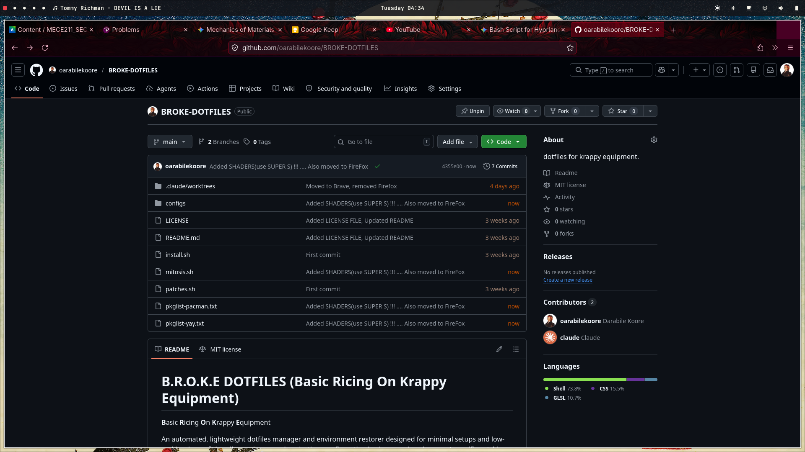

# B.R.O.K.E DOTFILES (Basic Ricing On Krappy Equipment)



**B**asic **R**icing **O**n **K**rappy **E**quipment

An automated, lightweight dotfiles manager and environment restorer designed for minimal setups and low-end hardware. It handles package synchronization, configuration backups, and environment-specific patching.

## System Architecture

The workflow is divided into three core scripts:

* `mitosis.sh`: The backup agent. It scans the current environment, exports lists of explicitly installed `pacman` and `yay` packages, and copies defined configuration directories into the local repository while preserving their structural hierarchy.
* `install.sh`: The deployment agent. It reads the exported package lists to sync installed software, automatically bootstraps `yay` if missing, deploys the backed-up configurations back to the home directory, and triggers the patch routine.
* `.patches.sh`: The environment fixer. It runs post-installation to handle system-specific quirks, such as creating legacy symlinks (e.g., mapping `awww` to `swww` for Waypaper compatibility).

## Prerequisites

* Arch Linux or an Arch-based distribution.
* `pacman` package manager.
* `git` and `base-devel` (for bootstrapping the AUR helper).

## Usage

### 1. Backing Up (Mitosis)
Run this command on your configured machine to capture the current state.

```bash
cd BROKE.DOTFILES
./mitosis.sh
```

This will generate:
* `pkglist-pacman.txt`
* `pkglist-yay.txt`
* A `configs/` directory containing your backed-up files (e.g., `hypr`, `waybar`, `vicinae`, `.bashrc`).

### 2. Restoring (Installation)
Clone or copy the `BROKE.DOTFILES` directory to the target machine and execute the installer.

```bash
cd BROKE.DOTFILES
./install.sh
```

This process will:
1.  Update the system and install official repository packages.
2.  Install `yay` if it is not present.
3.  Install AUR packages.
4.  Copy configurations from the `configs/` directory into your `$HOME` directory.
5.  Execute `.patches.sh` to fix environment inconsistencies.

## Keybindings & Shortcuts

The environment is built around **Hyprland**, utilizing the `SUPER` key as the main modifier.

### Applications & Utilities
* `SUPER` + `RETURN` or `X` : Open Terminal (Kitty)
* `SUPER` + `B` : Web Browser (Chrome)
* `SUPER` + `E` : File Manager (Nautilus)
* `SUPER` + `D` : App Launcher (Vicinae)
* `SUPER` + `W` : Wallpaper Picker (Waypaper)
* `SUPER` + `;` : Clipboard History
* `Print Screen`: Take a screenshot (Peck)

### Custom Scripts & System Controls
* `SUPER` + `L` : Lock Screen (Hyprlock)
* `SUPER` + `S` : Shader Picker (Apply visual screen shaders)
* `SUPER` + `SHIFT` + `B` : Toggle Waybar (Auto-hide vs Locked open)
* `SUPER` + `SHIFT` + `C` : Toggle Caffeine (Prevent sleep/idle)
* `SUPER` + `SHIFT` + `P` : Connect Android Phone (scrcpy modes)

### Window Management
* `SUPER` + `Q` : Close Active Window
* `SUPER` + `F` : Toggle Fullscreen
* `SUPER` + `V` : Toggle Floating & Center Window
* `SUPER` + `J` : Toggle Split
* `SUPER` + `P` : Pin Window
* `SUPER` + `Tab` : Cycle Windows (Bring to top)

### Navigation & Layout
* `SUPER` + `[1-0]` : Switch to Workspace 1-10
* `SUPER` + `SHIFT` + `[1-0]` : Move Window to Workspace 1-10
* `SUPER` + `Left/Right/Up/Down` : Move Focus
* `SUPER` + `SHIFT` + `Left/Right/Up/Down` : Swap Window Position
* `SUPER` + `- / =` : Shrink / Grow Window Size
* `SUPER` + `SHIFT` + `- / =` : Resize Width Only
* `SUPER` + `CTRL` + `- / =` : Resize Height Only

## Modifying the Backup List

To add new configurations to the backup routine, open `mitosis.sh` and add the relative path (starting from `$HOME`) to the `CONFIGS` array.

```bash
CONFIGS=(
  ".config/hypr"
  ".config/waybar"
  ".config/vicinae"
  ".bashrc"
  ".config/new_app" # Add new paths here
)
```

# LICENSE 

MIT.
```
